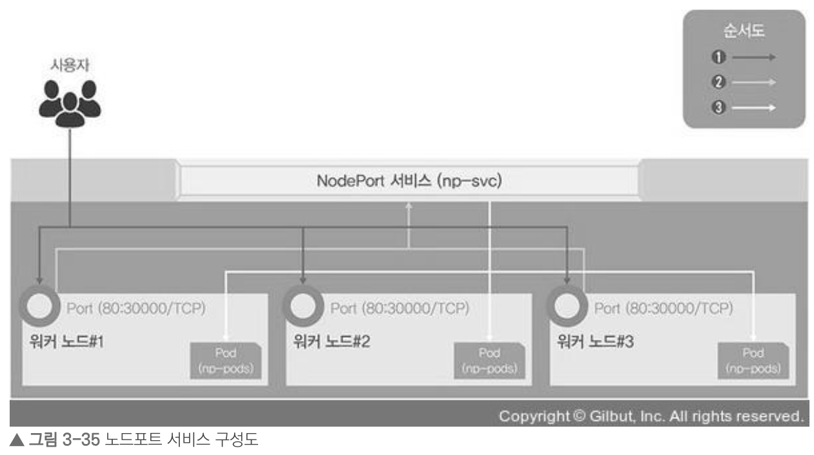
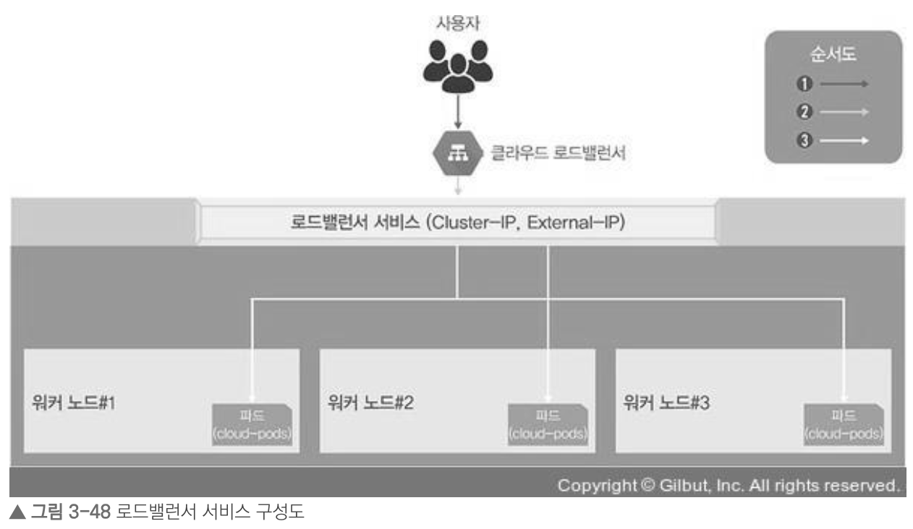

# 쿠버네티스 연결을 담당하는 서비스

쿠버네티스에서의 서비스는 외부에서 쿠버네티스 클러스터에 접속하는 방법을 뜻함

## 가장 간단하게 연결하는 노드포트

- 노드포트: 외부에서 쿠버네티스 클러스터의 내부에 접속하는 가장 쉬운 방법
- 노드포트 서비스를 설정하면, 모든 워커 노드의 노드포트를 열고 여기로 오는 모든 요청을 노드포트 서비스로 전달
- 노드포트 서비스는 해당 업무를 처리할 수 있는 파드로 요청을 전달

   
ref) https://thebook.io/080241/0181/

 

### 1. 노드포트 서비스로 외부에서 접속하기

- 노드포트 yaml 파일 구조에서는 kind가 Service로 바뀌며, spec에 컨테이너에 대한 정보가 없음
- 또한, 접속에 필요한 네트워크 관련 정보와 서비스의 type을 NodePort로 지정

### 2. 부하 분산 테스트하기

- 1개의 파드에서 3개로 증가시켜서 부하 분산 테스트를 해보면, 3개의 파드로 돌아가면서 접속되는 것을 확인할 수 있음
- 노드포트의 오브젝트 스펙에 적힌 레이블 키와 디플로이먼트의 이름을 확인해 동일하면 같은 파드라고 간주

### 3. expose로 노드포트 서비스 생성하기

- `expose` 명령어를 통해서도 노드포트 서비스를 생성할 수 있음
- 해당 명령어로 노드포트 서비스를 사용하면, 노드포트 포트 번호를 지정할 수 없고, 30000~32767에서 임의로 지정됨

## 사용 목적별로 연결하는 인그레스

- 노드포트 서비스는 포트를 중복 사용할 수 없어서 1개의 노드포트에 1개의 디플로이먼트만 적용됨
- 여러 개의 디플로이먼트가 있을 때, **인그레스**를 통해 그 수만큼 노드포트 서비스를 구동할 수 있음
- 인그레스(Ingress)는 고유한 주소를 제공해 사용 목적에 따라 다른 응답을 제공할 수 있음
- 또한, 트래픽에 대한 L4/L7 로드밸런서와 보안 인증서를 처리하는 기능을 제공함
- 인그레스를 사용하려면 인그레스 컨트롤러가 필요하고, 파드와 직접 통신할 수 없기에 노드포트 또는 로드밸런서 서비스와 연동되어야 함

## 클라우드에서 쉽게 구성 가능한 로드밸런서

- 이전까지는 들어오는 요청을 모두 워커 노드의 노드포트를 통해 노드포트 서비스로 이동하고 이를 다시 쿠버네티스의 파드로 보내는 구조
- 해당 방식은 매우 비효율적으로, 쿠버네티스에서는 로드밸런서 서비스 타입을 제공하여 간단한 구조로 파드를 외부에 노출하고 부하를 분산함
- 로드밸런서를 사용하려면, 이미 구현해 둔 서비스업체의 도움을 받아 쿠버네티스 클러스터 외부에 구현해야 함

   
ref) https://thebook.io/080241/0206/