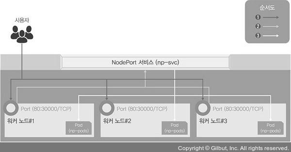
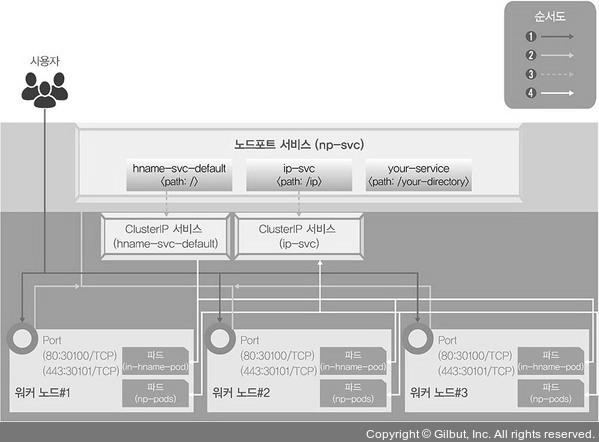

# 쿠버네티스 연결을 담당하는 서비스
쿠버네티스는 내부에서 파드를 사용하는 것뿐만 아니라 외부에서도 파드를 사용할 수 있습니다.  
쿠버네티스에서는 외부에서 쿠버네티스 클러스터에 접속하는 방법을 서비스라 합니다.
</br>
</br>

## 1. 노드포트 (NodePort)
노드포트를 이용하면 간단하게 외부에서 쿠버네티스 클러스터의 내부에 접속할 수 있습니다.
</br>
</br>
노드포트 서비스를 설정하면 모든 워커 노드의 특정 포트(노드포트)를 열고 여기로 오는 모든 요청을 노드포트 서비스로 전달하고, 노드포트 서비스는 해당 업무를 처리할 수 있는 파드로 요청을 전달합니다.



</br>

### 1-1. 노드포트 서비스로 외부에서 접속하기
<details>
    <summary>실습</summary>

#### ① 디플로이먼트로 파드를 생성합니다.
```
kubectl create deployment np-pods --image=sysnet4admin/echo-hname
```
sysnet4admin : 계정  
echo-hname : 이미지
</br>
</br>

#### ② 배포된 파드를 확인합니다.
```
kubectl get pods
```
</br>

#### ③ 오브젝트 스펙을 이용하여 노드포트 서비스를 생성합니다.
```
kubectl create -f ~/_Book_k8sInfra/ch3/3.3.1/nodeport.yaml
```
</br>

#### (nodeport.yaml)
```
apiVersion: v1  
kind: Service  
metadata:  
    # 서비스의 이름  
        name: np-svc

spec:  
    # 셀렉터의 레이블 지정  
    selector:  
        app: np-pods

    # 사용할 프로토콜과 포트들을 지정  
    ports:  
        - name: http  
        protocol: TCP  
        port: 80  
        targetPort: 80  
        nodePort: 30000

    # 서비스 타입을 설정  
    type: NodePort
```
</br>

#### ④ 노드포트 서비스로 생성한 np-svc 서비스를 확인합니다.
```
kubectl get services
```
</br>

#### ⑤ 쿠버네티스 클러스터의 워커노드 IP를 확인합니다.
```
kubectl get nodes -o wide
```
</br>

#### ⑥ 192.168.1.101~103:30000(확인한 워커 노드의 IP와 노드포트의 포트번호)로 접속하여 외부에서 접속되는지 확인합니다. 이때 파드가 하나이므로 화면에 보이는 이름은 모두 동일하며, 외부에서 접속이 가능한 것을 확인할 수 있습니다.

</details>

</br>

### 1-2. 부하 분산 테스트하기
부하가 분산되는지(로드밸런서 기능) 확인해 보겠습니다.  
즉, 디플로이먼트로 생성된 파드 1개에 접속하고 있는 중에 파드가 3개로 증가하면 접속이 어떻게 바뀌는지 확인해 보겠습니다.
</br>

<details>
    <summary>실습</summary>
  
#### ① 파워셸에서 반복적으로 워커 노드의 IP 주소에 접속해 접속한 파드 이름을 화면에 표시하여, 파드가 1개에서 3개로 늘어나는 시점을 관찰할 수 있도록 합니다.
```
$i=0; while($true)  
{  
    % { $i++; write-host 0NoNesline "$i $_" }  
    (Invoke-RestMethod "http://192.168.1.101:30000")-replace '\n', " "  
}
```
</br>

#### ② 쿠버네티스 마스터 노드에서 scale을 실행해 파드를 3개로 증가시킵니다.
```
kubectl scale deployment np-pods --replicas=3
```
</br>

#### ③ 배포된 파드를 확인합니다.
```
kubectl get pods
```
</br>

#### ④ 파워셸 명령 창을 확인해 표시하는 파드 이름에 배포된 파드가 3개가 돌아가면서 표시되는지 확인합니다.
</br>
</br>
부하 분산이 제대로 되는지 확인할 수 있으며, 노드포트의 오브젝트 스펙에 적힌 np-pods와 디플로이먼트의 이름을 확인해 동일하면 같은 파드라고 간주하기 때문에 추가된 파드를 외부에서 추적해 접속할 수 있는 것입니다.
</br>
</br>
또한, 추적 방법은 이름뿐만 아니라 다양한 방법이 존재합니다.

</details>

</br>

### 1-3. expose로 노드포트 서비스 생성하기
노드포트 서비스는 오브젝트 스펙 파일뿐만 아니라 expose 명령어로도 생성할 수 있습니다.

<details>
    <summary>실습</summary>

#### ① expose 명령어를 사용해 서비스로 내보낼 디플로이먼트를 np-pods로 지정합니다.
```
kubectl expose deployment np-pods --type=NodePort --namenp-svc-v2 --port=80
```
np-svc-v2 : 해당 서비스의 이름  
NodePort : 타입  
80 : 서비스가 파드로 보내줄 연결 포드
</br>
</br>

#### ② 생성된 서비스를 확인합니다.
```
kubectl get services
```
expose를 사용하면 노드포트의 포트 번호를 지정할 수 없고, 포트 번호는 30000~32767에서 임의로 지정됩니다.
</br>
</br>

#### ③ 192.168.1.101:32122(생성된 포트 번호)에 접속하여 배포된 파드 중 하나의 이름이 웹 브라우저에 표시되는지 확인합니다.
</br>

#### ④ 다음 실습 진행을 위해 배포한 디플로이먼트와 서비스 2개를 모두 삭제합니다.
```
kubectl delete deployment np-pods  
kubectl delete services np-svc  
kubectl delete services np-svc-v2
```

</details>

</br>
</br>

## 2. 인그레스 (Ingress)
인그레스는 고유한 주소를 제공해 사용 목적에 따라 다른 응답을 제공할 수 있고, 트래픽에 대한 L4/L7 로드밸런서와 보안 인증서를 처리하는 기능을 제공합니다.
</br>
</br>
쉽게 말해 인그레스 컨트롤러의 궁극적인 목적은 사용자가 접속하는 경로에 따라 다른 결괏값을 제공하는 것입니다.
</br>
</br>
노드포트 서비스는 포트를 중복 사용할 수 없어서 1개의 노드포트에 1개의 디플로이먼트만 적용되기 때문에, 여러 개의 디플로이먼트가 있고 그 수만큼 노드포트 서비스를 구동해야 할 때 사용됩니다.
</br>
</br>
인그레스를 사용하려면 인그레스 컨트롤러가 필요하며, 다양한 인그레스 컨트롤러가 있지만 쿠버네티스에서 프로젝트로 지원하는 NGINX 인그레스 컨트롤러로 구성해 보겠습니다.
</br>
</br>

### 2-1. NGINX 인그레스 컨트롤러 서비스 구성도
인그레스 컨트롤러는 파드와 직접 통신할 수 없기 때문에 노드포트/로드밸런서 서비스와 연동되어야 하며, 여기서는 노드포트로 연동했습니다.



#### ① 사용자는 노드마다 설정된 노드포트를 통해 노포트 서비스로 접속합니다. 이때 노드포트 서비스를 NGINX 인그레스 컨트롤러로 구성합니다.

#### ② NGNIX 인그레스 컨트롤러는 사용자의 접속 경로에 따라 적합한 클러스터 IP 서비스로 경로를 제공합니다.

#### ③ 클러스터 IP 서비스는 사용자를 해당 파드로 연결해 줍니다.

</br>

### 2-2. 실습을 통한 NGINX 인그레스 컨트롤러 생성
<details>
    <summary>실습</summary>

#### ① 테스트용으로 디플로이먼트 2개를 배포합니다.
```
kubectl create deployment in-hname-pod --imagesysnet4admin/echo-hname  
kubectl create deployment in-ip-pod --image=sysnet4admin/echo-ip
```
</br>

#### ② 배포된 파드의 상태를 확인합니다.
```
kubectl get pods
```
</br>

#### ③ NGINX 인그레스 컨트롤러를 설치합니다.
```
kubectl apply -f ~/_Book_k8Infra/ch3/3.3.2/ingress-hginx.yaml
```
</br>

#### ④ NGINX 인그레스 컨트롤러의 파드가 배포되었는지 확인합니다.
```
kubectl get pods -n ingress-nginx
```
-n : default 외의 네임스페이스를 확인할 때 사용하는 옵션
</br>
</br>

#### ⑤ 인그레스를 사용자 요구 사항에 맞게 설정하기 위해 경로와 작동을 정의합니다.
```
kubectl apply -f ~/_Book_k8Infra/ch3/3.3.2/ingress-config.yaml
```
</br>

#### (ingress-config.yaml)
```
apiVersion: networking.k8s.io/v1beta1  
kind: Ingress  
metadata:  
    # Ingress의 이름  
    # 이름을 통해서 통신할 ingress 컨트롤러를 확인  
    name: ingress-nginx

    # 메타데이터의 기록 및 변경  
    # 여기선 rewrite-target을 /(기본 주소)로 지정함  
    annotations:  
        nginx.ingress.kubernetes.io/rewrite-target: /

spec:  
    # 규칙을 지정  
    rules:  
    - http:  
        paths:

        # 기본 경로 규칙  
        - path:

            # 연결되는 서비스와 포트  
            backend:  
                serviceName: hname-svc-default  
                servicePort: 80

            # 기본 경로에 ip라는 이름의 경로 추가  
            - path: /ip

            # 연결되는 서비스와 포트  
            backend:  
                serviceName: ip-svc  
                servicePort: 80

            # 기본 경로에 your-directory 경로 추가  
            - path: /your-directory

            # 연결되는 서비스와 포트  
            backend:  
                serviceName: your-svc  
                servicePort: 80
```
</br>

#### ⑥ 인그레스 설정 파일이 제대로 등록됐는지 확인합니다.
```
kubectl get ingress
```
</br>

#### ⑦ 인그레스에 요청한 내용이 확실하게 적용되었는지 확인합니다.
```
kubectl get ingress -o yaml
```
인그레스에 적용된 내용을 야믈 형식으로 출력해 적용된 내용을 확인할 수 있습니다.
</br>
</br>

#### ⑧ NGINX 인그레스 컨트롤러 생성과 인그레스 설정을 완료했으며, 외부에서 NGINX 인그레스 컨트롤러에 접속할 수 있게 노드포트 서비스로 NGINX 인그레스 컨트롤러를 외부에 노출합니다.
```
kubectl apply -f ~/_Book_k8Infra/ch3/3.3.2/ingress.yaml
```
</br>

#### (ingress.yaml)
```
apiVersion: v1  
kind: Service  
metadata:  
    # 서비스 이름  
    name: nginx-ingress-controller

    # 네임스페이스 이름  
    namespace: ingress-nginx  
spec:

    # 사용할 프로토콜과 포트들을 지정  
    ports:

    # http에 대한 프로토콜 및 포트 지정  
    - name: http  
        protocol: TCP  
        port: 80  
        targetPort: 80  
        nodePort: 30100

    # https에 대한 프로토콜 및 포트 지정  
    - name: https  
        protocol: TCP  
        port: 443  
        targetPort: 443  
        nodePort: 30101

    # 셀렉터의 레이블 지정  
    selector:  
        app.kubernetes.io/name: ingress-nginx

    # 서비스 타입을 설정  
    type: NodePort
```
기존 노드포트와 달리 http를 처리하기 위해 30100번 포트로 들어온 요청을 80번 포트로 넘기고, https를 처리하기 위해 30101번 포트로 들어온 것을 443번 포트로 넘깁니다.  
또한 NGINX 인그레스 컨트롤러가 위치하는 네임스페이스를 ingress-nginx로 지정하고 NGINX 인그레스 컨트롤러의 요구 사항에 따라 셀렉터를 ingress-nginx로 지정합니다.
</br>
</br>

#### ⑨ 노드포트 서비스로 생성된 NGINX 인그레스 컨트롤러를 확인합니다.
```
kubectl get services -n ingress-nginx
```
</br>

#### ⑩ 외부와 통신하기 위해 클러스터 내부에서만 사용하는 파드를 클러스터 외부에 노출할 수 있는 구역으로 옮기기 위해 디플로이먼트도 서비스로 노출합니다.
```
kubectl expose deployment in-hname-pod --name=hname-svc-default --port80, 443  
kubectl expose deployment in-ip-pod --name=ip-svc --port80, 443
```
내부와 외부 네트워크를 분리해 관리하는 DMZ(DeMilitarized Zone, 비무장지대)와 유사한 기능입니다.  
즉, 각 방에 있는 물건을 외부로 내보내기 전에 공용 공간인 거실로 모두 옮기는 것입니다.
</br>
</br>

#### ⑪ 생성된 서비스를 점검해 디플로이먼트들이 서비스에 정상적으로 노출되는지 확인합니다.
```
kubectl get services
```
새로 생성된 서비스는 default 네임스페이스에 있으므로 -n 옵션으로 네임스페이스를 지정하지 않아도 됩니다.
</br>
</br>

#### ⑫ 192.168.1.101:30100 와 192.168.1.101:30100/ip에 접속해 외부에서 접속되는 경로에 따라 다르게 작동하는지 확인합니다.
</br>

#### ⑬ https://192.168.1.101:30101 와 192.168.1.101:30101/ip에도 접속하여 HTTPS 연결도 정상적으로 작동하는지 확인합니다.
</br>

#### ⑭ 다음 실습 진행을 위해 배포한 디플로이먼트와 모든 서비스를 삭제합니다.
```
kubectl delete deployment in-hname-pod  
kubectl delete deployment in-ip-pod  
kubectl delete services hname-svc-default  
kubectl delete services ip-svc
```
</br>

#### ⑮ 설치 파일을 이용해 NGINX 인그레스 컨트롤러와 관련된 내용도 모두 삭제합니다.
```
kubectl delete -f ~/_Book_k8sInfra/ch3/3.3.2/ingress-nginx.yaml  
kubectl delete -f ~/_Book_k8sInfra/ch3/3.3.2/ingress-config.yaml
```

</details>

</br>
</br>

## 3. 로드밸런서 (LoadBalancer)
앞선 연결 방식은 들어오는 요청을 모두 워커 노드의 노드포트를 통해 노드포트 서비스로 이동하고 이를 다시 쿠버네티스의 파드로 보내는 구조이므로 매우 비효율적입니다.  
쿠버네티스에서는 로드밸런서라는 서비스 타입을 제공해 간단한 구조로 파드를 외부에 노출하고 부하를 분산합니다.
</br>
</br>

### 3-1. 로드밸런서 구성도


이러한 로드밸런서를 사용하려면 로드밸런서를 이미 구현해 둔 서비스 업체의 도움을 받아 쿠버네티스 클러스터 외부에 구현해야 합니다.
</br>
</br>
만약 클라우드에서 제공하는 쿠버네티스를 사용하고 있다면 아래와 같이 선언만 하면 됩니다.
```
kubectl expose deployment ex-lb --type=LoadBalancer --name=ex-svc  
kubectl get services ex-svc
```
쿠버네티스 클러스터에 로드밸런서 서비스가 생성돼 외부와 통신할 수 있는 IP가 부여되고 외부와 통신할 수 있으며 부하도 분산됩니다.

</br>
</br>
</br>
</br>
</br>
</br>
</br>
</br>
</br>
</br>
</br>
출처 : https://thebook.io/080241/
