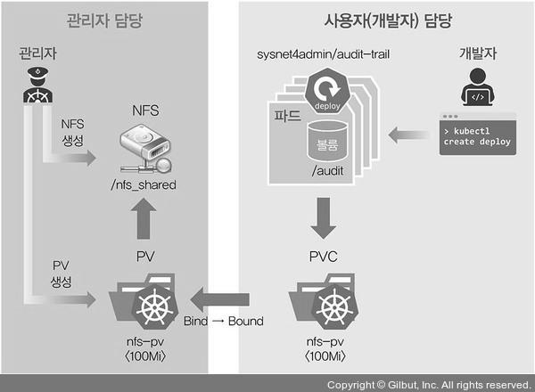
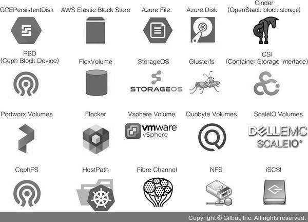
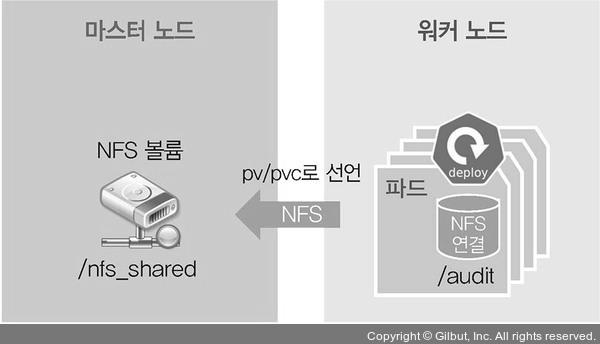

# 쿠버네티스 오브젝트
쿠버네티스에는 용도에 따라 사용할 수 있는 다양한 오브젝트가 정의되어 있습니다.
</br>
</br>

## 1. 데몬셋 (DaemonSet)
데몬셋은 디플로이먼트의 replicas가 노드 수만큼 정해져 있는 형태이며, 노드 하나당 파드 한 개만을 생성합니다.
</br>
</br>
데몬셋은 Calico 네트워크 플러그인과 kube-proxy를 생성하거나 MetalLB의 스피커 등 노드의 단일 접속 지점으로 노드 외부와 통신할 때 사용됩니다.  
따라서 파드가 1개 이상 필요하지 않으며, 노드를 관리하는 파드라면 데몬셋으로 만드는 게 가장 효율적입니다.
</br>
</br>

<details>
    <summary>데몬셋의 작동 원리 실습</summary>

① 현재 MetalLB의 스피커가 각 노드에 분포되어 있는 상태를 확인합니다.
```
kubectl get pods -n metallb-system -o wide
```
</br>

② Vagrantfile을 수정하여 워커 노드를 1개 늘립니다.
(Vagrantfile)
```
# -*- mode: ruby -*-
# vi: set ft=ruby :

Vagrant.configure("2") do |config|
    # 3 => 4
    N = 4 # max number of worker nodes
    Ver = '1.18.4' # Kubernetes Version to install

    #=============#
    # Master Node #
    #=============#
[생략]
```
</br>

③ 새로운 워커 노드(w4-k8s)를 추가합니다.
```
cd C://HashiCorp//_Book_k8sInfra-main//ch3//3.1.3
vagrant up w4-k8s
```
</br>

④ 오브젝트 상태 변화를 확인합니다. 변화를 확인한 후 Ctrl + C를 눌러 명령을 중지합니다.
```
kubectl get pods -n metallb-system -o wide -w
```
-w : watch. 오브젝트 상태에 변화가 감지되면 해당 변화를 출력
</br>
</br>

⑤ 자동으로 추가된 노드에 설치된 스피커가 데몬셋이 맞는지 확인합니다.
```
kubectl get pods speaker-vnc2k -o yaml -n metallb-system
```
speaker-vnc2k : 생성된 스피커 이름  
kind : DaemonSet 을 통해 추가된 워커 노드에 데몬셋이 정상적으로 설치되고 작동하는 것을 확인할 수 있습니다.
</br>

</details>

</br>
</br>

## 2. 컨피그맵 (ConfigMap)
설정을 목적으로 사용하는 오브젝트입니다.
</br>
</br>
인그레스에서는 설정을 위해 오브젝트를 인그레스로 선언하지만, MetalLB에서는 프로젝트 타입으로 정해진 오브젝트가 없기에 범용 설정으로 사용되는 컨피그맵을 사용합니다.
</br>
</br>

<details>
    <summary>컨피그맵으로 작성된 MetalLB의 IP 설정 변경 실습</summary>

① 테스트용 디플로이먼트를 chgmap이라는 이름으로 생성합니다.
```
kubectl create deployment cfgmap --image=sysnet4admin/echo-hname
```
</br>

② cfgmap을 로드밸런서(MetalLB)를 통해 노출하고 이름은 cfgmap-svc로 지정합니다.
```
kubectl expose deployment cfgmap --type=LoadBalancer --name=cfgmap-svc --port=80
```
</br>

③ 생성된 서비스의 IP(192.168.1.11)를 확인합니다.
```
kubectl get services
```
</br>

④ 사전에 구성되어 있는 컨피그맵의 기존 IP(192.168.1.11~192.168.1.13)를 sed 명령을 사용해 192.168.1.21~192.168.1.23으로 변경합니다.
```
cat ~/_Book_k8sInfra/ch3/3.4.2/metallb-l2config.yaml | grep 192.  
sed -i 's/11/21/;s/13/23/' ~/_Book_k8sInfra/ch3/3.4.2/metallb-l2config.yaml  
cat ~/_Book_k8sInfra/ch3/3.4.2/metallb-l2config.yaml | grep 192.
```
</br>

⑤ 컨피그맵 설정 파일(metallb-l2config.yaml)에 apply를 실행해 변경된 설정을 적용합니다.
```
kubectl apply -f ~/_Book_k8sInfra/ch3/3.4.2/metallb-l2config.yaml
```
</br>

⑥ MetalLB와 관련된 모든 파드를 삭제합니다.
```
kubectl delete pods --all -n metallb-system
```
삭제하고 나면 kubelet에서 해당 파드를 자동으로 모두 다시 생성합니다.
</br>
</br>

⑦ 새로 생성된 MetalLB의 파드들을 확인합니다.
```
kubectl get pods -n metallb-system
```
</br>

⑧ 기존에 노출한 MetalLB 서비스(cfgmap-svc)를 삭제하고 동일한 이름으로 다시 생성해 새로운 컨피그맵을 적용한 서비스가 올라오게 합니다.
```
kubectl delete service cfgmap-svc
kubectl expose deployment cfgmap --type=LoadBalancer --name=cfgmap-svc --port=80
```
</br>

⑨ 변경된 설정이 적용되어 새로운 MetalLB 서비스의 IP가 192.168.1.21로 바뀌었는지 확인합니다.
```
kubectl get services
```
</br>

⑩ 192.168.1.21로 접속해 파드의 이름이 화면에 표시되는지 확인합니다.
</br>
</br>

⑪ 다음 테스트를 위해 생성한 디플로이먼트와 서비스를 삭제합니다.
```
kubectl delete deployment cfgmap
kubectl delete service cfgmap-svc
```
</br>

</details>

</br>
</br>

## 3. PV와 PVC
쿠버네티스에서는 의도적으로 파드가 언제라도 생성되고 지워지도록 구현했습니다.
</br>
</br>
하지만 파드에서 생성한 내용을 기록하고 보관하거나 모든 파드가 동일한 설정값을 유지하고 관리하기 위해 공유된 볼륨으로부터 공통된 설정을 가지고 올 수 있도록 설계해야 할 때도 있습니다.
</br>
</br>
쿠버네티스는 이런 경우를 위해 다음과 같은 목적으로 다양한 형태의 볼륨을 제공하며, 이 중 PV와 PVC에 대해 알아보겠습니다.
</br>
</br>

### 3-1. 목적별 볼륨 형태
* 임시 : emptyDir  
* 로컬 : host Path, local  
* 원격 : persistentVolumeClaim, cephfs, cinder, csi, fc(fibre channel), flexVolume, flocker, glusterfs, iscsi, nfs, portworxVolume, quobyte, rbd, scaleIO, storageos, vsphereVolume  
* 특수 목적 : downwardAPI, configMap, secret, azureFile, projected  
* 클라우드 : awsElasticBlockStore, azureDisk, gcePersistentDisk
</br>

### 3-2. PV(PersistentVolume, 지속적으로 사용 가능한 볼륨)와 PVC(PersistentVolumeClaim, 지속적으로 사용 가능한 볼륨 요청) 란
쿠버네티스는 필요할 때 PVC를 요청해 사용하며, PVC를 사용하려면 PV로 볼륨을 선언해야 합니다.  
쉽게 말해 PV는 볼륨을 사용할 수 있게 준비하는 단계이고, PVC는 준비된 볼륨에서 일정 공간을 할당받는 것입니다.  
비유하자면 PV는 요리사(관리자)가 피자를 굽는 것이고, PVC는 손님(사용자)이 원하는 만큼의 피자를 접시에 담아 가져오는 것입니다.
</br>
</br>
PV와 PVC의 관계를 정리하면 다음과 같습니다.



PVC는 PV와 구성이 거의 동일하지만 PV는 사용자가 요청할 볼륨 공간을 관리자가 만들고, PVC는 사용자(개발자) 간 볼륨을 요청하는 데 사용한다는 점에서 차이가 있습니다.
</br>
</br>
또한 PV로 볼륨을 선언할 수 있는 타입은 아래와 같습니다.  



</br>
</br>
이 중 가장 구현하기 쉬운 NFS 볼륨 타입으로 PV와 PVC를 생성하고 파드에 마운트 해 보면서 실제로 어떻게 작동하는지 확인해 보겠습니다.
</br>
</br>

### 3-3. NFS 볼륨에 PV/PVC를 만들고 파드에 연결하기
NFS 볼륨을 이용한 PV/PVC 연결 구성도는 아래와 같습니다.



</br>

<details>
    <summary>실습</summary>

① PV로 선언할 볼륨을 만들기 위해 NFS 서버를 마스터 노드에 구성합니다. 공유되는 디렉터리를 만들고 해당 디렉터리를 NFS로 받아들일 IP 영역을 설정합니다.
```
mkdir /nfs_shared
echo '/nfs_shared 192.168.1.0/24(rw,sync,no_root_squash)' >> /etc/exports
```
</br>

② 해당 내용을 시스템에 적용해 NFS 서버를 활성화하고 다음에 시작할 때도 자동으로 적용되도록 합니다.
```
systemctl enable --now nfs
```
</br>

③ 오브젝트 스펙을 실행해 PV를 생성합니다.
```
kubectl apply -f ~/_Book_k8sInfra/ch3/3.4.3/nfs-pv.yaml
```
</br>

(nfs-pv.yaml)
```
apiVersion: v1
kind: PersistentVolume
metadata:
    name: nfs-pv
spec:
    capacity:
    storage: 100Mi
    accessModes:
    - ReadWriteMany
    persistentVolumeReclaimPolicy: Retain
    nfs:
    server: 192.168.1.10
    path: /nfs_shared
```
* 6~7번째 줄  
현재 스토리지가 단순히 NFS로 설정되어 있기 때문에, storage는 실제로 사용하는 용량을 제한하는 것이 아닌 쓸 수 있는 양을 레이블로 붙이는 것과 같습니다
* 8~9번째 줄  
PV를 어떤 방식으로 사용할지를 정의한 부분입니다.  
ReadWriteMany : 여러 개의 노드가 읽고 쓸 수 있도록 마운트 하는 옵션입니다.  
ReadWriteOnce : 하나의 노드에서만 볼륨을 읽고 쓸 수 있게 마운트 하는 옵션입니다.  
ReadOnlyMany : 여러 개의 노드가 읽도록 마운트 하는 옵션입니다.
* 10번째 줄  
persistentVolumeReclaimPolicy : PV가 제거됐을 때 작동하는 방법을 정의하는 것입니다. (Retain-유지, Delete-삭제, Recycle-재활용)
* 11~13번째 줄  
NFS 서버의 연결 위치에 대한 설정입니다.
</br>

④ 생성된 PV의 상태가 Available(사용 가능) 임을 확인합니다.
```
kubectl get pv
```
</br>

⑤ 오브젝트 스펙을 실행해 PVC를 생성합니다.
```
kubectl apply -f ~/_Book_k8sInfra/ch3/3.4.3/nfs-pvc.yaml
```
</br>

(nfs-pvc.yaml)
```
apiVersion: v1
kind: PersistentVolumeClaim
metadata:
    name: nfs-pvc
spec:
    accessModes:
        - ReadWriteMany
    resources:
        requests:
            storage: 10Mi
```
</br>

⑥ 생성된 PVC를 확인합니다.
```
kubectl get pvc
```
상태가 Bound(묶여짐)로 변경된 것을 확인할 수 있으며, 이는 PV와 PVC가 연결됐음을 의미합니다.  
또한 용량이 설정한 10Mi가 아닌 100Mi인 것을 확인할 수 있는데, 사실 용량은 동적으로 PVC를 따로 요청해 생성하는 경우가 아니면 큰 의미가 없습니다.
</br>
</br>

⑦ PV의 상태도 Bound로 바뀌었음을 확인합니다.
```
kubectl get pv
```
</br>

⑧ 생성한 PVC를 볼륨으로 사용하는 디플로이먼트 오브젝트 스펙을 배포합니다.
```
kubectl apply -f ~/_Book_k8sInfra/ch3/3.4.3/nfs-pvc-deploy.yaml
```
</br>

(nfs-pvc-deploy.yaml)
```
apiVersion: apps/v1
kind: Deployment
metadata:
    name: nfs-pvc-deploy
spec:
    replicas: 4
    selector:
        matchLabels:
            app: nfs-pvc-deploy
    template:
        metadata:
            labels:
                app: nfs-pvc-deploy
        spec:
            containers:
            - name: audit-trail
                image: sysnet4admin/audit-trail
                volumeMounts:
                - name: nfs-vol
                    mountPath: /audit
            volumes:
            - name: nfs-vol
                persistentVolumeClaim:
                    claimName: nfs-pvc
```
* 15~17번째 줄  
audit-trail 이미지를 가지고 오며, 해당 컨테이너 이미지는 요청을 처리할 때마다 접속 정보를 로그로 기록합니다.
* 18~20번째 줄  
볼륨이 마운트 될 위치(/audit)를 지정합니다.
* 21~24번째 줄  
PVC로 생성된 볼륨을 마운트 하기 위해서 nfs-pvc라는 이름을 사용합니다.
</br>

⑨ 생성된 파드를 확인합니다.
```
kubectl get pods
```
</br>

⑩ 생성한 파드 중 하나에 접속합니다.
```
kubectl exec -it nfs-pvc-deploy-7888b77964-69c8n -- /bin/bash
```
</br>

⑪ PVC의 마운트 상태를 확인합니다.
```
df -h
```
용량이 100Mi가 아닌 NFS 서버의 용량이 37G 임을 확인합니다.
</br>
</br>

⑫ audit-trail 컨테이너의 기능을 테스트하는데, 외부에서 파드(nfs-pv-deploy)에 접속할 수 있도록 expose로 로드밸런서 서비스를 생성합니다.
```
kubectl expose deployment nfs-pvc-deploy --type=LoadBalancer --name=nfs-pvc-deploy-svc --port=80
```
</br>

⑬ 생성한 로드밸런서 서비스의 IP를 확인합니다.
```
kubectl get services
```
</br>

⑭ 192.168.1.21에 접속해 파드 이름과 IP가 표시되는지 확인합니다.
</br>
</br>

⑮ exec를 통해 접속한 파드에서 ls /audit 명령을 실행해 접속 기록 파일이 남았는지 확인하고, cat으로 해당 파일의 내용도 함께 확인합니다.
```
ls /audit
cat /audit/audit_nfs-pvc-deploy-7888b77964-qwwsm.log
```
</br>

⑯ 마스터 노드(m-k8s)에서 파드를 4개에서 8개로 증가시킵니다.
```
kubectl scale deployment nfs-pvc-deploy --replicas=8
```
</br>

⑰ 생성된 파드를 확인합니다.
```
kubectl get pods
```
</br>

⑱ 최근에 증가한 4개의 파드 중 1개를 선택해 exec로 접속하고 기록된 audit 로그가 동일한지 확인합니다.
```
kubectl exec -it nfs-pvc-deploy-7888b77964-c6nrp -- /bin/bash
```
</br>

⑲ 192.168.1.21로 접속해 다른 파드 이름과 IP가 표시되는지를 확인합니다.
</br>
</br>

⑳ exec로 접속한 파드에서 ls /audit을 실행해 새로 추가된 audit 로그를 확인하고, cat으로 기록된 내용도 함께 확인합니다.
```
ls /audit
cat /audit/audit_nfs-pvc-deploy-7888b77964-mj6mt.log
```
</br>

㉑ 기존에 접속한 파드에서도 동일한 로그가 audit에 기록돼 있는지 확인합니다.
```
ls /audit
```
</br>

</details>
</br>

### 3-4. NFS 볼륨을 파드에 직접 마운트 하기

<details>
    <summary>실습</summary>

① 사용자가 관리자와 동일한 단일 시스템이라면 PV와 PVC를 사용할 필요가 없으므로, 단순히 볼륨을 마운트 하는지 확인하고 넘어가겠습니다.
```
kubectl apply -f ~/_Book_k8sInfra/ch3/3.4.3/nfs-ip.yaml
```
</br>

(nfs-ip.yaml)
```
apiVersion: apps/v1
kind: Deployment
metadata:
    name: nfs-ip
spec:
    replicas: 4
    selector:
        matchLabels:
            app: nfs-ip
    template:
        metadata:
            labels:
                app: nfs-ip
        spec:
            containers:
            - name: audit-trail
                image: sysnet4admin/audit-trail
                volumeMounts:
                - name: nfs-vol
                    mountPath: /audit
            volumes:
            - name: nfs-vol
                nfs:
                server: 192.168.1.10
                path: /nfs_shared
```
</br>

② 새로 배포된 파드를 확인하고 그중 하나에 exec로 접속합니다.
```
kubectl get pods
kubectl exec -it nfs-ip-84fd4d6f69-475vb -- /bin/bash
```
</br>

③ 접속한 파드에서 동일한 NFS 볼륨을 바라보고 있음을 확인합니다.
```
ls /audit
```
</br>

④ 다음 진행을 위해 설치한 PV와 PVC를 제외한 나머지인 파드와 서비스를 삭제합니다.
```
kubectl delete deployment nfs-pvc-deploy
kubectl delete deployment nfs-ip
kubectl delete service nfs-pvc-deploy-svc
```
</br>

</details>

</br>

실습을 통해 PV와 PVC를 구성하는 주체가 관리자와 사용자로 나뉜다는 것을 확인했습니다.  
또한 관리자와 사용자가 나뉘어 있지 않다면 굳이 PV와 PVC를 통하지 않고 바로 파드에 공유가 가능한 NFS 볼륨을 마운트 할 수 있음을 확인할 수 있습니다.
</br>
</br>
</br>

## 4. 스테이트풀셋
스테이트풀셋은 volumeClaimTemplates 기능을 사용해 PVC를 자동으로 생성할 수 있고, 각 파드가 순서대로 생성되기 때문에 고정된 이름, 볼륨, 설정 등을 가질 수 있습니다.  
다만, 효율성 면에서 좋은 구조가 아니므로 요구 사항에 맞게 적절히 사용하는 것이 좋습니다.
</br>
</br>
참고로 스테이트풀셋은 디플로이먼트와 형제나 다름없는 구조라 디플로이먼트에서 오브젝트 종류를 변경하면 바로 실습할 수 있습니다.
</br>
</br>

<details>
    <summary>실습</summary>

① PV와 PVC는 앞에서 이미 생성했으므로 바로 스테이트풀셋을 다음 명령으로 생성합니다.
```
kubectl apply -f ~/_Book_k8sInfra/ch3/3.4.4/nfs-pvc-sts.yaml
```
</br>

(nfs-pvc-sts.yaml)
```
apiVersion: apps/v1
kind: StatefulSet
metadata:
    name: nfs-pvc-sts
spec:
    replicas: 4
    serviceName: sts-svc-domain #statefulset need it
    selector:
        matchLabels:
            app: nfs-pvc-sts
    template:
        metadata:
            labels:
                app: nfs-pvc-sts
        spec:
            containers:
            - name: audit-trail
                image: sysnet4admin/audit-trail
                volumeMounts:
                - name: nfs-vol
                    mountPath: /audit
            volumes:
            - name: nfs-vol
                persistentVolumeClaim:
                    claimName: nfs-pvc
```
</br>

② 파드가 생성되는지는 확인합니다.
```
kubectl get pods -w
```
</br>

③ 생성한 스테이트풀셋에 expose를 실행합니다.
```
kubectl expose statefulset nfs-pvc-sts --type=LoadBalancer --name=nfs-pvc-sts-svc --port=80
```
expose 명령이 스테이트풀셋을 지원하지 않기 때문에 에러가 발생하고, 이를 해결하려면 파일로 로드밸런서 서비스를 작성, 실행해야 합니다.
</br>
</br>

④ 다음 경로를 적용해 스테이트풀셋을 노출하기 위한 서비스를 생성하고, 생성한 로드밸런서 서비스를 확인합니다.
```
kubectl apply -f ~/_Book_k8sInfra/ch3/3.4.4/nfs-pvc-sts-svc.yaml
kubectl get services
```
</br>

(nfs-pvc-sts-svc.yaml)
```
apiVersion: v1
kind: Service
metadata:
    name: nfs-pvc-sts-svc
spec:
    selector:
        app: nfs-pvc-sts
    ports:
        - port: 80
    type: LoadBalancer
```
</br>

⑤ 192.168.1.21에 접속해 파드 이름과 IP가 표시되는지를 확인합니다.
</br>
</br>

⑥ exec로 파드에 접속한 후에 ls /audit -l로 새로 접속한 파드의 정보가 추가됐는지 확인한 후, exit로 파드를 빠져나옵니다.
```
kubectl exec -it nfs-pvc-sts-0 -- /bin/bash
ls -l /audit
exit
```
</br>

⑦ 스테이트풀셋의 파드를 삭제하고, kubectl get pods -w 명령어를 통해 삭제되는 과정을 확인합니다.
```
kubectl delete statefulset nfs-pvc-sts
kubectl get pods -w
```
파드는 생성된 순서의 역순으로 삭제됩니다.
</br>

</details>

</br>
</br>
</br>
</br>
</br>
</br>
</br>
</br>
</br>
</br>
출처 : https://thebook.io/080241/
