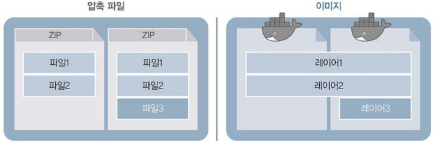

# 도커로 컨테이너 다루기
 

## 1. 컨테이너 이미지
컨테이너를 만들기 위해서는 이미지가 필요하며, 이미지는 레지스트리(registry)라고 하는 저장소에 모여 있습니다.  
레지스트리는 도커 허브(https://hub.docker.com) 처럼 공개된 유명 레지스트리일 수도 있고, 내부에 구축한 레지스트리일 수도 있습니다.
 
 
컨테이너 이미지는 애플리케이션과 각종 파일을 담고 있다는 점에서 ZIP 같은 압축 파일과 비슷하지만, 이미지는 같은 내용일 경우 여러 이미지에 동일한 레이어를 공유하므로 전체 용량이 감소합니다.

위와 같이 내용이 같은 파일 두 개가 각 압축 파일에서 공간을 독립적으로 점유하는 것과 달리, 이미지는 레이어를 공유하므로 상대적으로 용량을 적게 차지하게 됩니다.
 
 

### 1-1. docker search [검색어]
검색어를 포함하는 이미지가 있는지 찾습니다.
 
 

* #### INDEX
  \- 이미지가 저장된 레지스트리의 이름입니다.
* #### NAME
  \- 검색된 이미지 이름입니다.  
  \- 공식 이미지를 제외한 나머지는 [레지스트리 주소/저장소 소유자/이미지 이름] 형태입니다.
* #### DESCRIPTION
  \- 이미지에 대한 설명입니다.
* #### STARS
  \- 사용자에게 받은 평가 횟수입니다.
* #### OFFICIAL
  \- [OK] 표시는 해당 이미지에 포함된 애플리케이션, 미들웨어 등을 개발한 업체에서 공식적으로 제공한 이미지를 의미합니다.
* #### AUTOMATED
  \- [OK] 표시는 도커 허브에서 자체적으로 제공하는 이미지 빌드 자동화 기능을 활용해 생성한 이미지를 의미합니다.
 

### 1-2. docker pull [이미지]:[버전]
이미지를 내려받습니다.  
기본적으로 가장 최신 버전을 내려받으며, 안정화 버전을 사용하고 싶다면 stable을 사용합니다.
 
 

* #### 태그(tag)
  \- 이미지를 내려받을 때 사용한 태그를 알 수 있습니다.  
  \- 기본적으로 latest 태그가 적용되며, 가장 최신 이미지를 의미합니다.
* #### 레이어(layer)
  \- 하나의 이미지는 여러 개의 레이어로 이루어져 있어서 레이어마다 Pull complete가 발생합니다.
* #### 다이제스트(digest)
  \- 이미지의 고유 식별자로, 이미지에 포함된 내용과 이미지의 생성 환경을 식별할 수 있습니다.  
  \- 식별자는 해시 함수로 생성되며 이미지가 동일한지 검증하는 데 사용합니다.
* #### 상태(status)
  \- 이미지를 내려받은 레지스트리, 이미지, 태그 등의 상태 정보를 확인할 수 있습니다.  
  \- [레지스트리 이름/이미지 이름] 형태입니다.
 

### 1-3. docker images [이미지]
내려받은 이미지를 조회합니다.
 
 

### 1-4. docker history [이미지]
이미지의 생성 과정과 용량을 확인합니다.
 
 
 

## 2. 컨테이너 실행
### 2-1. docker run [옵션] [사용할 이미지 이름]:[태그 | @다이제스트]
컨테이너를 생성합니다.  
컨테이너를 생성하면 컨테이너를 식별할 수 있는 고유한 ID가 문자열로 출력됩니다.
 
 

* #### -d 옵션
  \- 컨테이너를 백그라운드에서 구동합니다.
* #### --restart 옵션
  \- 컨테이너가 비정상적으로 종료되거나 리눅스 시스템에서 도커 서비스가 시작될 때와 관련된 정책을 의미합니다.  
  \- no (기본값) : 컨테이너 비정상 종료 시-컨테이너 재시작 X / 도커 서비스 시작 시-컨테이너 시작 X  
  \- on-failure : 컨테이너 비정상 종료 시-컨테이너 재시작 O / 도커 서비스 시작 시-컨테이너 시작 O  
  \- always : 컨테이너 비정상 종료 시-컨테이너 재시작 O / 도커 서비스 시작 시-컨테이너 시작 O  
  \- unless-stopped : 컨테이너 비정상 종료 시-컨테이너 재시작 O / 도커 서비스 시작 시-사용자가 직접 정지하지 않은 컨테이너만 시작
* #### -p [요청받을 호스트 포트]:[연결할 컨테이너 포트] 옵션
  \- 외부에서 호스트로 보낸 요청을 컨테이너 내부로 전달합니다.
* #### -v [호스트 디렉터리 경로]:[컨테이너 디렉터리 경로] 옵션
  \- 호스트 디렉터리와 컨테이너 디렉터리를 연결합니다.  
  \- 호스트 디렉터리의 내용을 그대로 컨테이너 디렉터리에 덮어씌울 때 사용합니다. 따라서 컨테이너 디렉터리에 어떠한 내용이 있더라도 해당 내용은 삭제됩니다.
 

## 2-2. docker ps [옵션]
생성한 컨테이너 상태를 확인합니다.
 
 

* #### --name [이름] 옵션
  \-컨테이너 이름을 직접 지정할 수 있습니다.
* #### -f [필터링 키=필터링 값] 옵션
  \- 검색 결과를 필터링할 수 있습니다.  
  \- id : 컨테이너 아이디  
  \- name : 컨테이너 이름  
  \- label : 컨테이너 레이블  
  \- exited : 컨테이너가 종료되었을 때 반환하는 숫자 코드  
  \- status : 컨테이너의 작동 상태  
  \- ancestor : 컨테이너가 사용하는 이미지
* #### -q 옵션
  \- 컨테이너 ID만 출력합니다.
* #### -a 옵션
  \- 정지된 컨테이너를 포함한 모든 컨테이너를 조회합니다.
* #### CONTAINER ID
  \- 컨테이너를 식별하기 위한 고유 ID입니다.
* #### IMAGE
  \- 컨테이너를 만드는 데 사용한 이미지입니다.
* #### COMMAND
  \- 컨테이너가 생성될 때 내부에서 작동할 프로그램을 실행하는 명령어입니다.
* #### CREATED
  \- 컨테이너가 생성된 시각을 표시합니다.
* #### STATUS
  \- 컨테이너가 작동을 시작한 시각을 표시합니다.  
  \- CREATED와 달리 컨테이너를 중지했다가 다시 시작할 경우 초기화됩니다.
* #### PORTS
  \- 컨테이너가 사용하는 포트와 프로토콜을 표시합니다.
* #### NAMES
  \- 컨테이너 이름을 표시합니다.
 
 

## 3. 컨테이너 내부 파일 변경
컨테이너 내부에서 컨테이너 외부의 파일을 사용할 수 있는 방법은 크게 4가지가 있습니다.
 
 

### 3-1. docker cp [호스트 경로] [컨테이너 이름]:[컨테이너 내부 경로]
호스트에 위치한 파일을 구동 중인 컨테이너 내부에 복사합니다.  
컨테이너에 임시로 필요한 파일이 있는 경우 단편적으로 전송하기 위해 사용하거나, 컨테이너에 저장되어 있는 설정 및 로그를 추출해 확인하는 목적으로도 사용합니다.
 
 

### 3-2. Dockerfile ADD
Dockerfile에서 ADD 구문에 컨테이너 내부로 복사할 파일을 지정하면 이미지를 빌드 할 때 복사됩니다.  
이후 해당 이미지를 기반으로 구동한 컨테이너에서는 복사한 파일을 사용할 수 있습니다.  
단, 사용자가 원하는 파일을 선택해 사용할 수 없다는 약점이 존재합니다.
 
 

### 3-3. 바인드 마운트
호스트의 파일 시스템과 컨테이너 내부를 연결해 어느 한쪽에서 작업한 내용이 양쪽에 동시에 반영됩니다.  
새로운 컨테이너를 구동할 때도 호스트와 연결할 파일이나 디렉터리의 경로만 지정하면 다른 컨테이너에 있는 파일을 새로 생성한 컨테이너와 연결할 수 있습니다.  
데이터베이스의 데이터 디렉터리나 서버의 첨부 파일 디렉터리처럼 컨테이너가 바뀌어도 없어지면 안 되는 자료는 이 방법으로 보존할 수 있습니다.
 
 

### 3-4. 볼륨
호스트의 파일 시스템과 컨테이너 내부를 연결하는 것은 바인드 마운트와 동일하지만, 호스트의 특정 디렉터리가 아닌 도커가 관리하는 볼륨을 컨테이너와 연결합니다.  
도커가 관리하는 볼륨 공간을 NFS와 같은 공유 디렉터리에 생성한다면 다른 호스트에서도 도커가 관리하는 볼륨을 함께 사용할 수 있습니다.  
또한 오랫동안 고정된 내용을 각 사용자마다 다르게 취하는 경우에는 바인드 마운트나 볼륨이 효과적입니다.
 
 

* #### docker volume create [생성할 볼륨 이름]
  \- 볼륨을 생성합니다.  
  \- 볼륨은 도커가 직접 관리하며 컨테이너에 제공하는 호스트의 공간입니다.
* #### docker volume inspect [생성된 볼륨 이름]
  \- 생성된 볼륨을 조회합니다.  
  \- 볼륨에 적용된 드라이버 종류와 실제 호스트에 연결된 디렉터리, 볼륨 이름 등을 조회할 수 있습니다.
 

|구분|docker ps|Dockerfil ADD|바인드 마운트|볼륨|
|---|---|---|---|---|
|컨테이너 적용|구동 중 복사|이미지 생성 시 복사|구동 시 디렉터리 연결|구동 시 도커의 볼륨 연결|
|파일 보관 위치|컨테이너 내부|컨테이너 내부|호스트(디렉터리)|호스트(도커 볼륨)|
|주 활용 용도|임시 파일|컨테이너 생성 시 필요한 파일|보존이 필요한 파일|보존이 필요한 파일|
|관리 편의성|좋지 못함|좋음|좋음|매우 좋음|
|파일 보존성|좋지 못함|좋음|매우 좋음|매우 좋음|

 
 

## 4. 사용하지 않는 컨테이너 정리
사용이 끝나고 더 이상 사용하지 않을 컨테이너라면 공간을 확보하기 위해 삭제하는 것이 좋습니다.
 
 

### 4-1. docker stop [컨테이너 이름 | ID]
컨테이너를 정지합니다.  
컨테이너나 이미지를 삭제하거나, 동일한 호스트의 포트를 사용하는 컨테이너를 배포하거나, 작동 중인 컨테이너의 사용 자체를 종료할 때는 컨테이너를 먼저 정지해야 합니다.
 
 

### 4-2. docker start [컨테이너 이름 | ID]
정지한 컨테이너를 다시 구동합니다.
 
 

### 4-3. docker rm [컨테이너 이름 | ID]
정지한 컨테이너를 삭제합니다.
 
 

* #### -f 옵션
  \- 실행 중인 컨테이너를 강제로 삭제합니다.  
  \- 의도하지 않은 삭제가 일어날 수 있으니 주의해야 합니다.
 

### 4-4. docker rmi [이미지 이름 | ID]
이미지를 삭제합니다.   
이미지는 컨테이너가 정지 상태가 아닌 삭제 상태일 때 삭제할 수 있으므로, 이미지를 삭제하기 전에 컨테이너를 먼저 삭제해야 합니다.
 
 
 
 
 
 
 
 
 
 
 
출처 : https://www.refinar.life/kubernetes/2
