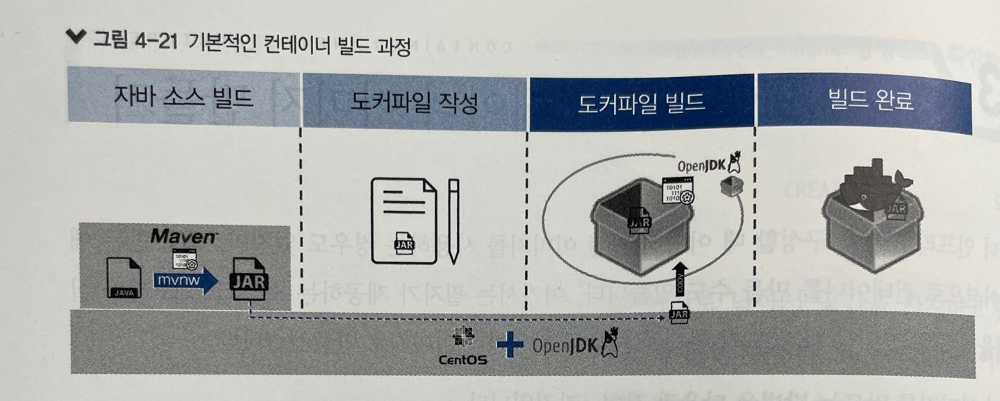
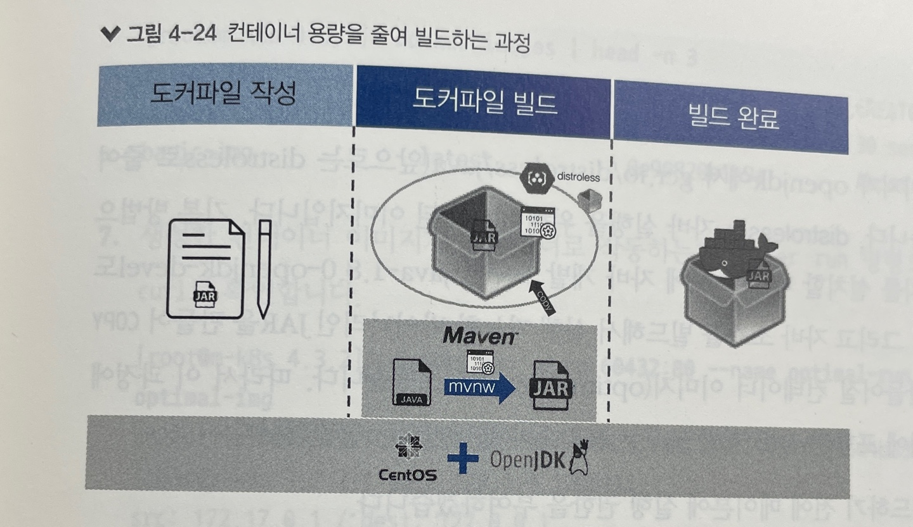
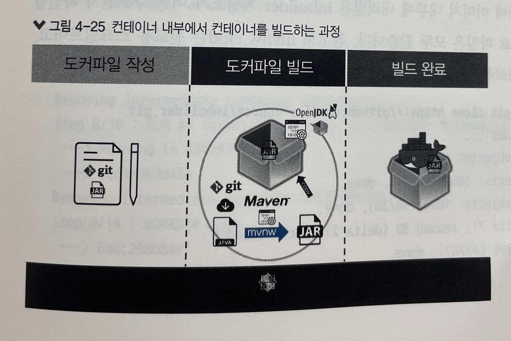
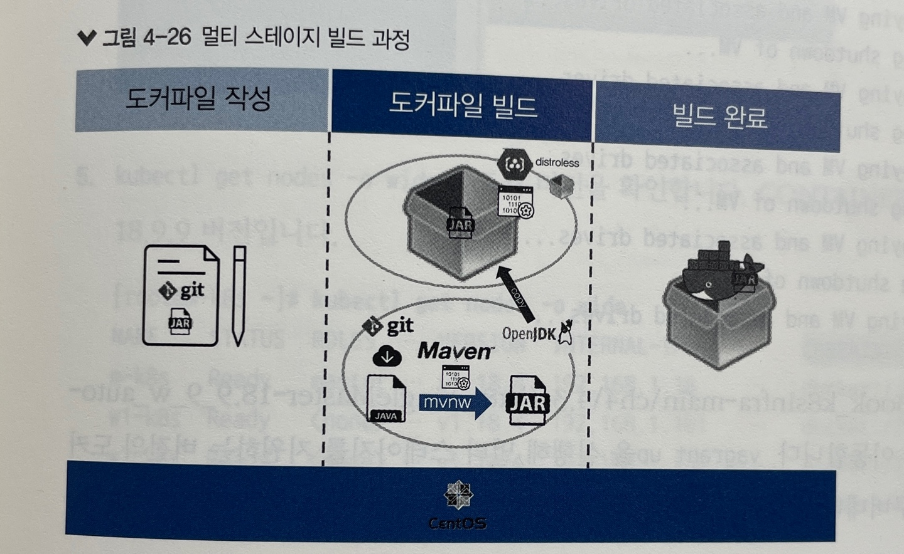

# 4가지 방법으로 컨테이너 이미지 만들기

## #1 기본 방법으로 빌드하기

### 기본적인 컨테이너 빌드 과정

### Dockerfile

- 빌드용 DSL(Domain-Specific Languages)로 작성된 파일
- 내용 구성
    - FROM <이미지 이름>:[태그]
        - 이미지를 가져오고, 가져온 이미지 내부에서 컨테이너 이미지를 빌드
    - LABEL <레이블 이름>=<값>
        - 이미지에 부가적인 설명을 위한 레이블 추가
    - EXPOSE <숫자>
        - 생성된 이미지로 컨테이너를 구동할 때, 어떤 포트를 사용하는지 정보 제공
    - COPY <호스트 경로> <컨테이너 경로>
        - 호스트에서 새로 생성하는 컨테이너 이미지로 필요한 파일을 복하
    - WORKDIR <경로>
        - 이미지의 현재 작업 위치를 변경
    - ENTRYPOINT ["명령어", "옵션"... "옵션"]
        - 컨테이너 구동 시, 대괄호 안에 든 명령 실행

**외부, 내부 IP로부터의 요청 출발지가 다른 이유는 내부 IP에서 들어오는 요청은 docker-proxy 프로세스가 컨테이너 내부로 요청을 전달하기 때문**   
**그래서 내부 IP(127.0.0.1)에서 요청이 들어오면 출발지는 컨테이너 브리지 인터페이스의 IP(ex. 172.17.0.1)가 됨**

## #2 컨테이너 용량 줄이기

### 컨테이너 용량을 줄여 빌드하는 과정

실습: openjdk -> GCR(Google Container Registry)에서 제공하는 distroless

## #3 컨테이너 내부에서 컨테이너 빌드하기

### 컨테이너 내부에서 컨테이너를 빌드하는 과정

**컨테이너 내부에서 컨테이너를 빌드하는 것은 가장 큰 컨테이너 이미지를 얻게 됨**   
**컨테이너 이미지가 클수록 비효율적이지만, Dockerfile 하나만 빌드하면 컨테이너가 바로 생성되는 편리함 존재**

## #4 최적화해 컨테이너 빌드하기

멀티 스테이지 빌드(Multi-Stage Build): 최종 이미지의 용량을 줄일 수 있고, 호스트에 어떠한 빌드 도구도 설치할 필요가 없음

### 멀티 스테이지 빌드 과정

**멀티 스테이지의 핵심은 빌드하는 위치와 최종 이미지를 '분리'하는 것**   
이름이 없는 이미지를 댕글링(dangling) 이미지라고 하며, 멀티 스테이지 빌드 과정에서 생성될 수 있음

# 쿠버네티스에서 직접 만든 컨테이너 사용하기

## 레지스트리 구성하기

- 호스트에서 생성한 이미지를 쿠버네티스에서 사용하려면, 모든 노드에서 공통으로 접근하는 레지스트리가 필요
- 도커나 쿠버네티스는 도커 허브에서 이미지를 내려받으면 됨
- 도커에서 제공하는 도커 레지스트리 이미지를 사용해 사설 도커 레지스트리 생성 가능
- 가장 많이 사용되는 레지스트리
    - Quay(키)
        - 레드햇에서 제공
        - 안정적인 서비스를 운영하고자 하는 사용자에게 적합
    - Harbor(하버)
        - Project Harbor에서 오픈 소스로 제공
        - 이미지와 헬름 차트 모두 사용하고자 하는 사용자에게 적합
    - Nexus Repository(넥서스 레포지토리)
        - Sonatype에서 제작
        - 여러 형식의 패키지를 하나의 저장소에 관리하려는 사용자에게 적합
    - Docker Registry(도커 레지스트리)
        - 도커에서 제공
        - 개인 및 테스트 용도로 적합
- 도커는 이미지를 올리거나 내려받으려고 레지스트리에 접속하는 과정에서 주체 대체 이름(SAN, Subject Alternative Name)이라는 추가 정보를 검증하기에, 요청서에 추가 정보를 기입하여 인증서를
  생성하는 과정 필요
   
