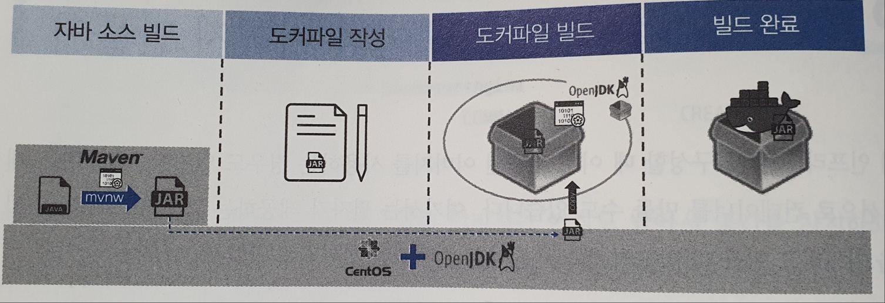
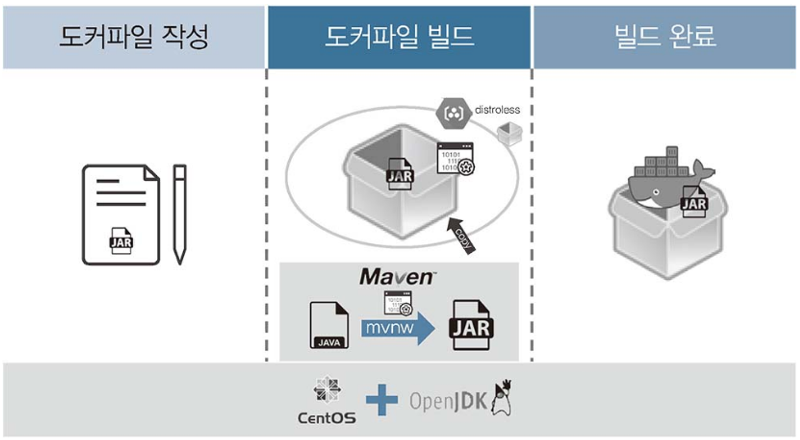
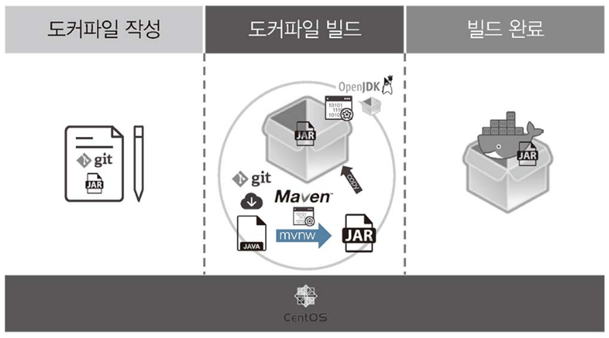
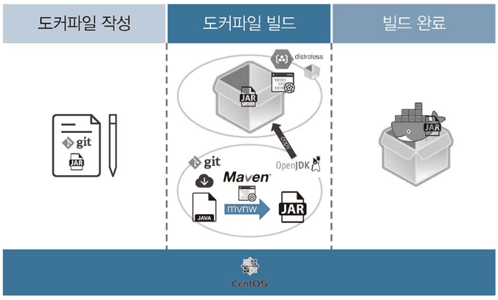

# 컨테이너 이미지 만들기
</br>

## 1. 기본 방법으로 빌드 하기



스프링 부트를 이용해 만든 자바 소스 코드로 이미지를 빌드 해보겠습니다.
</br>

<details>
    <summary>실습</summary>
</br>

① 기본적인 컨테이너 빌드 도구와 파일이 있는 빌드 디렉터리로 이동해 어떤 파일이 있는지 확인합니다.
```
cd ~/_Book_k8sInfra/ch4/4.3.1/
ls
```
* Dockerfile  
  \- 컨테이너 이미지를 빌드 하기 위한 정보를 담고 있습니다.  
* mvnw  
  \- 메이븐 래퍼라는 이름의 리눅스 스크립트로, 메이븐 실행을 위한 환경 설정을 자동화합니다.  
* pom.xml  
  \- 메이븐 래퍼가 작동할 때 필요한 절차와 빌드 정보를 담고 있습니다.  
* src(디렉터리)  
  \- 메이븐으로 빌드 할 자바 소스 디렉터리입니다.
</br>

② 소스 코드가 자바로 작성되어 있으므로 실행 가능한 바이너리로 만들기 위해 현재 시스템에 자바 개발 도구를 설치합니다.
```
yum install java-1.8.0-openjdk-devel -y
```
</br>

③ 자바를 빌드 하기 위해 메이븐을 실행합니다.
```
chmod 700 mvnw  
./mvnw clean package
```
mvnw clean package 명령은 빌드를 진행할 디렉터리를 비우고, JAR을 생성합니다.
</br>
</br>

④ 자바 빌드가 끝나면 생성된 JAR 파일을 확인하기 위해 target 디렉터리를 확인합니다.
```
ls target
```
</br>

⑤ 컨테이너 이미지를 빌드 합니다.
```
docker build -t basic-img .
```
-t : 만들어질 이미지를 의미합니다.  
. : 이미지에 원하는 내용을 추가하거나 변경하는 데 필요한 작업 공간을 현재 디렉터리로 지정함을 의미합니다.
</br>

(Dockerfile)
```
FROM openjkd:8  
LABEL description="Echo IP Java Application"  
EXPOSE 60431  
COPY ./target/app-in-host.jar /opt/app-in-image.jar  
WORKDIR /OPT  
EVTRYPOINT [ "java", "-jar", "app-in-image.jar" ]
```
* FROM [이미지 이름]:[태그]  
  \- 이미지를 가져옵니다.  
* LABEL [레이블 이름]=[값]  
  \- 이미지에 부가적인 설명을 위한 레이블을 추가할 때 사용합니다.  
* EXPOSE [숫자]  
  \- 생성된 이미지로 컨테이너를 구동할 때 어떤 포트를 사용하는지 알려줍니다.  
  \- 컨테이너를 구동할 때 자동으로 해당 포트를 호스트 포트와 연결하지 않으므로, 외부와 접속하려면 docker rum -p를 사용해야 합니다.  
* COPY [호스트 경로] [컨테이너 경로]  
  \- 호스트에서 새로 생성하는 컨테이너 이미지로 필요한 파일을 복사합니다.  
* WORKDIR [경로]  
  \- 이미지의 현재 작업 위치를 변경합니다.  
* ENTRYPOINT [ "명령어", "옵션" ]  
  \-컨테이너 구동 시 명령어를 실행합니다.
</br>

⑥ 생성한 이미지를 확인합니다.
```
docker images basic-img
```
</br>

⑦ 태그 옵션(-t)을 추가해 1.0과 2.0 태그의 이미지도 생성해 봅니다.
```
docker build -t basic-img:1.0 -t basic-img:2.0 .
```
캐시가 사용되어 매우 빠르게 빌드 되는 것을 확인할 수 있습니다.
</br>
</br>

⑧ 생성된 이미지를 확인합니다.
```
docker images basic-img
```
이미지가 모두 ID와 용량이 같은 것을 확인할 수 있습니다.  
즉, 태그 정보만 다를 뿐 모두 같은 이미지이며, 한 공간을 사용합니다.
</br>
</br>

⑨ sed를 사용해 Dockerfile 내용 중 일부만 변경하여 다시 빌드 해봅니다.
```
sed -t 's/Application/Development/' Dockerfil  
docker build -t basic-img:3.0 .
```
</br>

⑩ 생성된 이미지를 확인합니다.
```
docker images basic-img
```
완전히 다른 ID의 이미지가 생성된 것을 확인할 수 있습니다.  
즉, 이름은 같지만 실제로는 다른 컨테이너 이미지입니다.
</br>
</br>

⑪ 생성한 컨테이너 이미지가 컨테이너로 작동하는지 확인합니다.
```
docker run -d -p 60431:80 --name basic-run --restart always basic-img  
docker ps -f name=basic-run
```
</br>

⑫ 컨테이너가 정상적으로 외부 요청에 응답하는지 알아봅니다.
```
curl 127.00.0.1:60431
```
</br>

⑬ 작동 중인 컨테이너를 바로 삭제합니다.
```
docker rm -f basic-run
```
</br>

⑭ 빌드 한 컨테이너 이미지를 모두 삭제합니다.
```
docker rmi -f ${docker images -q basic-img)
```
</br>

⑮ 다음 실습을 위해 컨테이너 이미지 하나를 다시 빌드 합니다.
```
docker build -t basic-img .
```

</details>

</br>
</br>

## 2. 컨테이너 용량 줄이기


기본 방법보다 1단계가 줄고, 기초 이미지가 openjdk에서 GCR(Google Container Registry)에서 제공하는 distroless로 변경됩니다.

<details>
    <summary>실습</summary>
</br>

① Dockerfile 내용에 변경이 있으므로 살펴봅니다.
```
cd ~/_Book_k8sInfra/ch4/4.3.2  
cat Dockerfile
```
사용되는 기초 이미지가 openjdk에서 gcr.io/distroless/java로 변경되었습니다.  
distroless는 자바 실행을 위해 경량화된 이미지입니다.
</br>
</br>

② 경량화 이미지를 빌드 하기 전에 메이븐에 실행 권한을 부여하겠습니다.
```
chmod 700 mvnw
```
</br>

③ 경량화 이미지를 빌드 합니다.
```
./build-in-host.sh
```
</br>

④ 용량을 줄여 빌드 한 컨테이너 이미지와 기본 방법으로 빌드 한 이미지를 비교합니다.
```
docker images | hed -n 3
```
</br>

⑤ 생성한 컨테이너 이미지가 컨테이너로 작동하는지 컨테이너를 실행해 확인합니다.
```
docker run -d -p 60432:80 --name optimal-run --restart always optimal-img  
curl 127.0.0.1:60432
```
</br>

⑥ 컨테이너가 정상적으로 작동한다면 빌드 한 컨테이너를 삭제합니다.
```
docker rm -f optimal-run
```

</details>

</br>
</br>

## 3. 컨테이너 내부에서 컨테이너 빌드 하기



위와 같이 번거로운 과정 없이 openjdk 이미지를 기초 이미지로 컨테이너 내부에서 자바 소스를 빌드 하게 되면 가장 큰 컨테이너 이미지를 얻게 됩니다.  
이러한 컨테이너 이미지는 커지면 커질수록 비효율적으로 작동할 수밖에 없습니다.

<details>
    <summary>실습</summary>
</br>
  
① 빌드 과정 자체를 openjdk 이미지에서 진행하므로 Dockerfile만 있으면 됩니다.
```
cd ~/_Book_k8sInfra/ch4/4.3.3/  
ls  
cat Dockerfile
```
파일을 살펴보면 이미지 내부에 소스 코드를 내려받으려고 깃을 사용했고, 내려받은 소스 코드를 이미지 내부에서 실행하기 위해 RUN을 추가했습니다. 또한 이미지 내부에서 파일의 위치만 옮기면 되므로 COPY가 아닌 mv를 사용했습니다.
</br>
</br>

② 이미지를 빌드 하기 전 이미지 내부에 내려받은 inbuilder 저장소가 어떤 구조인지 확인합니다.
```
git clone https://github.com/iac-source/inbuilder.git
```
</br>

③ 컨테이너 이미지를 빌드 합니다.
```
docker build -t nohost-img .
```
</br>

④ 새로 빌드 한 컨테이너 이미지를 기존 이미지들과 비교합니다.
```
docker images | head -n 4
```
새로 생성된 nohost-img가 이미지 중에서 가장 용량이 큽니다. nohost-img는 컨테이너 내부에서 빌드를 진행하기 때문에 빌드 중간에 생성한 파일들과 내려받은 라이브러리 캐시들이 최종 이미지인 nohost-img에 그대로 남습니다. 따라서 빌드 최종 결과물만 전달했던 basic-img보다 더 커지게 됩니다.
</br>
</br>

⑤ 생성한 컨테이너 이미지가 잘 작동하는지 컨테이너를 실행해 확인합니다.
```
docker run -d -p 60433:80 --name nohost-run --restart always nohost-img  
curl 127.0.0.1:60433
```
</br>

⑥ 컨테이너가 정상적으로 작동함을 확인했다면 컨테이너를 삭제합니다.
```
docker rm -f nohost-run
```

</details>

</br>
</br>

## 4. 최적화해 컨테이너 빌드 하기



멀티 스테이지 빌드 방법은 최종 이미지의 용량을 줄일 수 있고 호스트에 어떠한 빌드 도구도 설치할 필요가 없습니다.

<details>
    <summary>실습</summary>
</br>
  
① 현재 사용하는 도커 버전을 확인합니다.
```
kubectl get nodes -o wide
```
</br>

② 기존에 사용하던 가상 머신들을 제거합니다.
```
cd C:\HashiCorp\_Book_k8sInfra-main\ch3\3.1.3  
vagrant destroy -f
```
</br>

③ 멀티 스테이지를 지원하는 버전의 도커가 포함된 새로운 쿠버네티스 클러스터 환경을 구성합니다.
```
cd C:\HashiCorp\_Book_k8sInfra-main\ch4\4.3.4\k8s-SingleMaster-18.9_9w_auto-compl  
vagrant up
```
</br>

④ 슈퍼 푸티로 m-k8s 노드에 접속하여 도커 버전을 확인합니다.
```
kubectl get nodes -o wide
```
</br>

⑤ 멀티 스테이지 방식으로 작성된 Dockerfile로 컨테이너 이미지를 빌드 합니다.
```
cd ~/_Book_k8sInfra/ch4/4.3.4/  
docker build -t multistage-img .
```
</br>

⑥ 이미지의 용량을 확인합니다.
```
docker images | head -n 3
```
optimal-img와 컨테이너 이미지의 용량이 같은 것을 확인할 수 있습니다.  
두 컨테이너 이미지는 빌드 단계가 같고 자바 소스를 호스트에서 빌드 했느냐, 컨테이너 내에서 빌드 했느냐의 차이밖에 없습니다.
</br>
</br>

⑦ 컨테이너 이미지 중에 <none>으로 표시되는 이미지를 댕글링(dangling) 이미지라 하며, 이를 삭제합니다.
```
docker rmi $(docker images -f dangling=true -q)
```
멀티 스테이지 과정에서 자바 소스를 빌드 하는 과정에 생성된 이미지이며, 공간을 적게 사용하는 이미지를 만드는 것이 목적이므로 삭제합니다.
</br>
</br>

⑧ 컨테이너를 실행하고 잘 작동하는지 확인합니다.
```
docker run -d -p 60434:80 --name multistage-run --restart always multistage-img  
curl 127.0.0.1:60434
```
</br>

⑨ 컨테이너가 정상적으로 작동함을 확인했다면 컨테이너를 삭제합니다.
```
docker rm -f multistage-run  
cd ~
```

</details>

</br>
</br>
</br>
</br>
</br>

# 쿠버네티스에서 직접 만든 컨테이너 사용하기

## 1. 쿠버네티스에서 도커 이미지 구동하기
<details>
    <summary>실습</summary>
</br>

① multistage-img 이미지가 노드에 존재하는지 확인합니다.
```
docker images multistage-img
```
</br>

② 디플로이먼트를 생성합니다.
```
kubectl create deployment failurel --image=multistage-img
```
</br>

③ 파드의 상태 및 변화를 확인합니다.
```
kubectl get pods -w
```
</br>

④ 내부에 존재하는 컨테이너 이미지를 사용하도록 설정해서 디플로이먼트를 생성합니다.
```
kubectl create deployment failure2 --dry-run=client -o yaml --image=multistage-img > failure2.yaml
```
</br>

⑤ 컨테이너 설정에 옵션을 추가합니다.
```
vi failure2.yaml
```

(failure2.yaml)
```
    spec:  
        containers:  
        - image: multistage-img  
          imagePullPolicy: Never # 추가한 부분  
          name: multistage-img  
          resources: {}  
status: {}
```
</br>

⑥ 수정한 failure2.yaml 파일을 디플로이먼트에 적용하고 상태를 확인합니다.
```
kubectl apply -f failure2.yaml  
kubectl get pods
```
내부의 이미지를 사용하도록 옵션을 추가했지만 여전히 오류가 발생합니다.
</br>
</br>

⑦ 정확하게 실습해 보기 위해 오류가 발생하는 디플로이먼트를 모두 삭제합니다.
```
kubectl delee deployment failure1  
kubectl delee deployment failure2
```
</br>

⑧ 슈퍼 푸티로 w3-k8s에 접속하고, 깃허브에 있는 Dockerfile을 받아 와 컨테이너 이미지를 만듭니다.
```
curl -0 https://raw.githubusercontent.com/sysnet4admin/_Book_k8sInfra/main/ch4/4.3.4/Dockerfile
```
</br>

⑨ 이미지를 빌드하고 결과가 성공적으로 이루어졌는지 확인합니다.
```
docker build -t multistage-img .
```
</br>

⑩ 마스터 노드로 돌아와 failure2.yaml을 success1.yaml로 복사합니다.
```
cp failure2.yaml success1.yaml
```
</br>

⑪ success1.yaml 파일에 replicas를 1에서 3으로 변경하고 failure2 이름도 success1로 변경합니다.
```
sed -i 's/replicas: 1/replicas: 3/' success1.yaml  
sed -i 's/replicas: 1/failure2/success1/' success1.yaml
```
</br>

⑫ 이미지 빌드가 완료되었는지 확인 후, success1.yaml를 실행하고 배포에 성공한 노드가 워커 노드 3번인지 확인합니다.
```
kubectl apply -f success1.yaml  
kubectl get pods -o wide
```
컨테이너 이미지가 워커 노드 3번에만 있기 때문에 워커 노드 3번만 배포에 성공할 수 있었습니다.  
워커 노드 1번과 2번에는 multistage-img가 없어서 파드를 생성할 수 없습니다.  
이를 해결하기 위해 기본으로 사용하는 도커 허브에 multistage-img를 올려서 다시 내려받거나 쿠버네티스 클러스터가 접근할 수 있는 곳에 이미지 레지스트리를 만들고 그곳에서 받아오도록 설정합니다.
</br>
</br>

⑬ 다음 실습을 위해 배포한 Deployment를 삭제합니다.
```
kubectl delete -f success1.yaml
```
</br>

⑭ 워커 노드 3번에 생성한 컨테이너 이미지와 댕글링 이미지도 삭제합니다.
```
docker rmi multistage-img  
docker rmi $(docker images -f dangling=true -q)
```

</details>

</br>
</br>

## 2. 레지스트리 구성하기
도커에서 제공하는 도커 레지스트리 이미지를 사용해 사설 도커 레지스트리를 만드는 방법을 알아보겠습니다.  
도커 레지스트리는 기능은 부족하지만, 컨테이너를 하나만 구동하면 돼서 설치가 간편하고 내부에서 테스트 목적으로 사용하기에 적합합니다.

<details>
    <summary>실습</summary>
</br>

① 사설 이미지 레지스트리 구성을 위한 파일들을 확인합니다.
```
ls ~/_Book_k8sInfra/ch4/4.4.2
```
</br>

② 레지스트리를 구성합니다.
```
~/_Book_k8sInfra/ch4/4.4.2/create-registry.sh
```
인증서 생성 및 배포 작업과 함께 레지스트리를 구동합니다. 직접 생성하고 자체적으로 검증하는 인증서를 자체 서명 인증서라고 합니다.
</br>

③ registry 컨테이너가 정상적으로 구동되는지 확인합니다.
```
docker ps -f name=registry
```
</br>
</br>

④ 사설 도커 레지스트리에 등록할 수 있게 컨테이너 이미지의 이름을 변경하겠습니다.
```
docker tag multistage-img 192.168.1.10:8443/multistage-img
```
새로운 이미지를 만드는 것이 아니라 이미지의 레이어를 공유하는 사본이 만들어집니다.
</br>
</br>

⑤ 이미지가 정상적으로 생성되었는지 확인합니다.
```
docker images 192.168.1.10:8443/multistage-img
```
</br>

⑥ multistage-img를 사설 도커 레지스트리에 등록합니다.
```
docker push 192.168.1.10:8443/multistage-img
```
</br>

⑦ 이미지가 정상적으로 등록되었는지 확인합니다.
```
curl https://192.168.1.10:8443/v2/_catalog -k
```
</br>

⑧ 호스트에 생성한 이미지는 더 이상 사용하지 않으니 삭제합니다.
```
docker images | grep multi
```
</br>

⑨ 이미지를 삭제합니다.
```
docker rmi -f aa23
```
</br>

⑩ 이미지가 정상적으로 삭제되었는지 확인합니다.
```
docker images | grep multistage
```

</details>

</br>
</br>

## 3. 직접 만든 이미지로 컨테이너 구동하기
직접 만든 이미지를 쿠버네티스에서 불러서 파드를 만드는 방법을 알아보겠습니다.

<details>
    <summary>실습</summary>
</br>

① success1.yaml을 복사해 success2.yaml을 생성합니다.
```
cp success1.yaml success2.yaml
```
</br>

② success2.yaml을 수정합니다.
```
vi success2.yaml
```

(success2.yaml)
```
    spec:  
        containers:  
        - image: 192.168.1.10:8443/multistage-img  
          name: multistage-img  
          resources: {}  
status: {}
```
</br>

③ 워커 노드 3번에 배포한 이미지와 중복되지 않게 이름을 바꿉니다.
```
sed -i 's/success1/success2/' success2.yaml
```
</br>

④ 새로운 디플로이먼트를 생성합니다.
```
kubectl apply -f success2.yaml
```
</br>

⑤ 생성된 디플로이먼트가 정상적으로 작동하는지 확인합니다.
```
kubectl get pods -o wide
```
</br>

⑥ 배포된 파드가 요청에 정상적으로 응답하는지 확인합니다.
```
curl 172.16.132.5  
curl 172.16.221.133  
curl 172.16.103.133
```
</br>

⑦ 직접 구성한 레지스트리에 올린 이미지를 디플로이먼트가 배포됨을 확인하였으므로, 배포한 디플로이먼트를 삭제합니다.
```
kubectl delete -f success2.yaml
```

</details>

</br>
</br>
</br>
</br>
</br>
</br>
</br>
</br>
</br>
</br>
</br>
출처 : https://www.refinar.life/kubernetes/2
